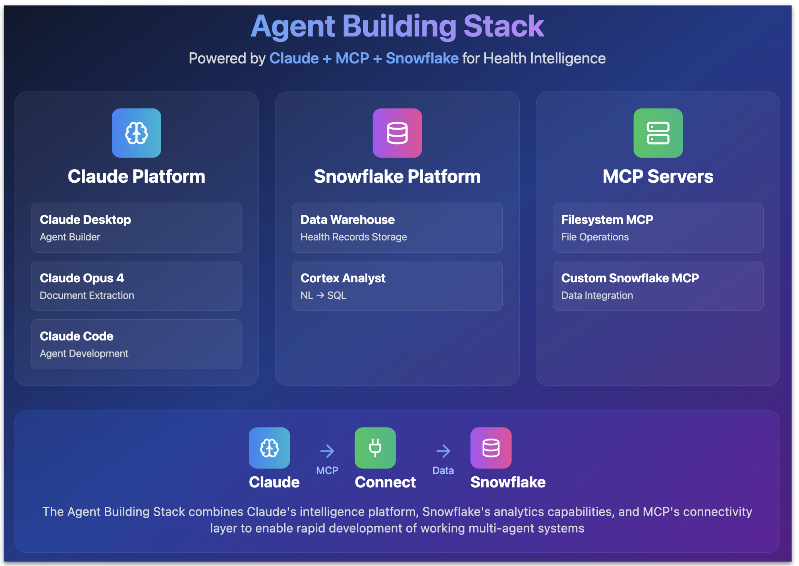

# Multi-Agent Health Insight System
## Transform Your Apple Health Data into Actionable Intelligence

> **A comprehensive multi-agent system that extracts, analyzes, and visualizes 12+ years of health data from Apple Health exports using Claude Desktop, Snowflake, and advanced AI agents.**

[](docs/images/arch-images/hero-image-multi-agent.png)

## Overview

### From Data Graveyard to Living Intelligence

This project demonstrates the power of modern AI agent architectures by solving a critical real-world problem: **Your health data is trapped in a digital graveyard**. 

Apple Health aggregates years of medical records, lab results, medications, and vitals from multiple healthcare providers into comprehensive PDFs. Yet this treasure trove of personal health data remains frustratingly inaccessible - static, unsearchable, and impossible to analyze. Your health history becomes a 200+ page document that no one reads, including you.

The solution transforms these static Apple Health PDF exports into a **conversational health intelligence system** that achieves:
- **100% extraction accuracy** - Every data point preserved
- **Natural language querying** - Ask questions like "What's my cholesterol trend?"
- **Instant insights** - From hours of manual analysis to seconds of AI-powered intelligence
- **12+ years of analysis** - Uncover patterns and correlations across your entire health history

## Learn More: Blog Series & Video Tutorials

### Part 1: Transform Health Data Into Intelligence
**Multi-Agent System with Claude + MCP + Snowflake**

[](https://youtu.be/VzHrmSlcQf4)

📺 **[Watch Part 1 Video](https://youtu.be/VzHrmSlcQf4)** | 📖 **[Read Part 1 Blog](https://medium.com/@george.vetticaden/from-data-graveyard-to-living-intelligence-building-multi-agent-health-systems-with-claudes-d4eb74f60c35)**

Learn how to build a multi-agent health system from scratch, including:
- Setting up the Health Data Extractor Agent in Claude Desktop
- Extracting 12+ years of health data with 100% accuracy
- Understanding the multi-agent architecture and design decisions

### Part 2: Cancelled Cursor & ChatGPT for This
**Building Multi-Agent Health System with Claude Code**

[](https://youtu.be/Rx1FWpB7XA8)

📺 **[Watch Part 2 Video](https://youtu.be/Rx1FWpB7XA8)** | 📖 **[Read Part 2 Blog](https://medium.com/@george.vetticaden/claude-code-the-agentic-development-revolution-that-made-me-cancel-cursor-copilot-chatgpt-67508130e2e5)**

Discover why Claude Code revolutionizes agentic development:
- Building custom MCP servers with Claude Code
- Creating Snowflake integrations and semantic models
- Achieving production-ready code in 1-2 attempts

## Architecture & Technology Stack

[](docs/images/arch-images/agent-building-tooling-stack.png)

The system leverages three core technologies:
- **Claude Desktop**: No-code agent creation with natural language instructions
- **Model Context Protocol (MCP)**: Seamless connections between agents and enterprise systems
- **Snowflake Cortex**: Enterprise-grade analytics with natural language processing

## Why Multi-Agent Architecture?

Traditional single-agent approaches fail at complex health data processing because they try to do everything at once. This project embraces **specialized agent collaboration** where each agent excels at one critical task:

1. **Extraction requires perfection** - The Extractor Agent focuses solely on 100% accurate data capture
2. **Analysis requires intelligence** - The Analyst Agent leverages enterprise tools for complex queries
3. **Scale requires specialization** - Processing 200+ pages demands optimized context windows

This separation of concerns delivers what users desperately need:
- ✅ Track biomarker trends across decades
- ✅ Instantly identify abnormal lab results  
- ✅ Correlate medication changes with health outcomes
- ✅ Generate insights from 12+ years of health history
- ✅ Create data-driven visualizations for healthcare providers

## Multi-Agent Component Architecture

[](docs/images/arch-images/multi-agent-component-architecture.png)

The architecture follows a clear **Extract → Load → Analyze** pipeline, with each component having one specialized job:

### (1) Health Data Extraction Agent
**Role**: Transforms unstructured PDFs into structured JSON with 100% accuracy

**Why it matters**: The extraction agent doesn't try to analyze or visualize - it just extracts perfectly. This laser focus on a single responsibility is what enables the **100% accuracy requirement** to be met consistently across hundreds of pages of complex medical data.

**Capabilities**:
- Processes 200+ page Apple Health PDF exports
- Extracts data using Claude Opus 4 with structured JSON schemas
- Organizes by clinical type and year to optimize context windows
- Validates extraction accuracy against source documents

**Configuration**:
- **Agent Platform**: Claude Desktop
- **LLM**: Claude Opus 4 (document intelligence optimized)
- **Knowledge Base**: Apple Health PDF + JSON extraction schemas
- **Output**: Structured JSON files by category and year

### (2) Health Analyst Agent  
**Role**: First loads extracted JSON files into Snowflake, then orchestrates the analytics workflow

The analyst agent coordinates specialized tools that excel at natural language processing and SQL generation, then executes the SQL against the Snowflake data warehouse after receiving the generated SQL from the Cortex Analyst endpoint.

**Capabilities**:
- Imports extracted JSON into Snowflake data warehouse
- Orchestrates natural language queries via Cortex Analyst
- Generates interactive visualizations using Claude Artifacts
- Provides comprehensive health dashboards and trend analysis

**Configuration**:
- **Agent Platform**: Claude Desktop
- **LLM**: Claude Opus 4 
- **Tools**: Custom MCP Server with Snowflake integration
- **Output**: Interactive React visualizations and health insights

### (3) Snowflake Data Warehouse
**Role**: Provides enterprise-grade storage and query performance

When you're dealing with 12 years of lab results across multiple providers, you need sub-second response times. Snowflake delivers the performance and scalability required for complex health analytics.

**Features**:
- Enterprise-grade cloud data platform
- Sub-second query response times for large datasets
- Automatic scaling and optimization
- Integrated Cortex Analyst capabilities

### (4) Snowflake Cortex Analyst
**Role**: Converts natural language to SQL with specialized focus

Cortex Analyst doesn't try to be a general chatbot - it does one thing brilliantly: understanding health-related questions and generating precise SQL queries against your structured health data.

**Capabilities**:
- Natural language to SQL translation
- Health domain-specific query understanding
- Semantic model-powered query generation
- Complex temporal and correlation analysis

### (5) Custom MCP Snowflake Server
**Role**: Provides the connectivity layer between agents and Snowflake

The MCP server bridges Claude Desktop agents with Snowflake infrastructure through two specialized tools: one for bulk data import, one for query execution.

**Tools Provided**:
- **Health Data Import Tool**: Batch processing of JSON extraction files
- **Natural Language Query Tool**: Real-time query execution via Cortex Analyst
- **Authentication**: Secure connection management with Snowflake
- **Error Handling**: Comprehensive validation and rollback capabilities

## Development with Claude Code

### Complete Workspace Understanding

This project demonstrates Claude Code's revolutionary approach to agentic development - a capability that represents the most fundamental difference from every other development tool available today.

[](docs/images/arch-images/claude-code-workspace-understanding.png)

Traditional development tools like Cursor and Copilot require constant manual context management: adding files to context, explaining component relationships, and ensuring the AI understands the broader architecture. This context overhead significantly limits productivity and often results in dozens of iterations to achieve working code.

**Claude Code eliminates this friction entirely** through automatic comprehension of your complete project structure.

### CLAUDE.md Framework Implementation

The key to unlocking Claude Code's capabilities lies in creating comprehensive design and requirements that serve as Claude Code's instruction manual. This project showcases the **CLAUDE.md Framework**:

**📋 Business Requirements** ([`agents/analyst-agent/config/`](agents/analyst-agent/config/))
- User workflows and access patterns
- Health query types and success criteria
- End-user perspective and use cases

**⚙️ Technical Requirements** ([`requirements/technical/`](requirements/technical/))
- Database design patterns and data modeling principles
- Cortex Analyst integration specifications
- MCP server implementation guidelines

### Development Velocity Results

This comprehensive context foundation transformed development outcomes:

- **🎯 Production-ready code in 1-2 attempts** instead of dozens of iterations
- **🚀 Complete MCP server generation** from technical specifications
- **📊 Semantic model creation** directly from business requirements
- **🗄️ Snowflake DDL generation** following data modeling principles
- **⏱️ Hours to seconds** - What took hours of manual coding now happens in seconds
- **🔄 Zero context switching** - Claude Code maintains full project understanding throughout

**Key Artifacts Built with Claude Code:**
- **Custom MCP Server** ([`tools/health-mcp/`](tools/health-mcp/)) - Complete implementation with dual health tools
- **Semantic Model** ([`semantic-model/snowflake/`](semantic-model/snowflake/)) - Cortex Analyst configuration
- **Database Schema** ([`data-store/snowflake/ddl/`](data-store/snowflake/ddl/)) - Enterprise-grade health data model

The upfront investment in creating detailed design and requirements pays exponential dividends in development velocity and code quality. This approach showcases how proper project structure enables Claude Code to function as a true development partner rather than just a code completion tool.

## Sample Analytics & Visualizations

The system generates comprehensive health insights:

### Cholesterol Trend Analysis (2013-2025)
[](docs/images/query-analysis-images/query-1-cholesterol-trend-analysis.png)

**Natural Language Query**: *"What's my cholesterol trend over the past decade?"*

**AI-Generated Insights**:
- 📉 33% decrease in total cholesterol over 12 years
- ⚠️ Identification of concerning triglyceride spike in 2025
- 💊 Correlation with medication adherence patterns
- 📊 Clear visualization of normal ranges vs. actual values

**From static PDF to actionable intelligence in seconds.**

### Advanced Correlation Analysis
[](docs/images/query-analysis-images/query-2-medication-lab-correlation.png)

**Query**: *"Analyze cholesterol medication adherence patterns and correlate with lab results over time"*

**Demonstrates**:
- Multi-factor analysis across medications, labs, and dosing
- Timeline correlation between statin therapy and cholesterol improvement
- Impact of dosage adjustments on health outcomes

### Abnormal Lab Detection
[](docs/images/query-analysis-images/query-3-abnormal-lab-results.png)

**Query**: *"Show my abnormal lab results from recent tests"*

**Features**:
- Automated detection of values outside normal ranges
- Trend identification across multiple biomarkers
- Clinical relevance scoring and recommendations

### Complex Multi-Factor Analysis
[](docs/images/query-analysis-images/query-4-weight-med-lab-correlation.png)

**Query**: *"How has my HbA1c changed since starting metformin, and is there correlation with weight measurements?"*

**Advanced Analytics**:
- Three-way correlation analysis (medication + labs + vitals)
- Statistical significance testing
- Predictive trend modeling
- Clinical decision support insights

## Technical Implementation

### Data Architecture
```
Database: HEALTH_INTELLIGENCE
Schema: HEALTH_RECORDS
Tables: PATIENTS, HEALTH_RECORDS, IMPORTS
```

**Design Principles**:
- Unified health records table (no separate tables per data type)
- Optimized for natural language query generation
- Snowflake Cortex Analyst compatible schema design
- Enterprise-grade data lineage and audit trails

### Custom MCP Server Tools

#### 1. Health Data Import Tool
```python
@mcp.tool()
async def snowflake_import_analyze_health_records_v2():
    """Import extracted health JSON files into Snowflake warehouse"""
```

**Features**:
- Batch processing of JSON extraction files
- Data validation and quality reporting
- Import statistics and visualization dashboard generation
- Error handling and rollback capabilities

#### 2. Natural Language Query Tool  
```python
@mcp.tool()
async def execute_health_query_v2():
    """Execute natural language health queries via Cortex Analyst"""
```

**Capabilities**:
- Snowflake Cortex Analyst integration
- Semantic model-powered SQL generation
- Complex multi-table joins and correlations
- Real-time query execution and result formatting

### Semantic Model Configuration
**File**: `semantic-model/snowflake/health_intelligence_semantic_model.yaml`

**Features**:
- Business-friendly data definitions for Cortex Analyst
- Pre-configured health metrics and relationships
- Natural language query optimization
- Support for complex temporal and correlation queries

## Getting Started

### Prerequisites
- **Claude Desktop** (for agent creation and management)
- **Snowflake Account** (for data warehousing and Cortex Analyst)
- **Python 3.9+** with `uv` package manager
- **Apple Health Export** (PDF format)

### Step 1: Export Your Apple Health Data

1. Open Apple Health app on iPhone
2. Tap your profile picture (top right)
3. Scroll down to "Export All Health Data"
4. Share the generated ZIP file
5. Extract and locate the `export.pdf` file (200+ pages)

### Step 2: Build the Health Data Extractor Agent

#### Create Agent in Claude Desktop
1. Open Claude Desktop
2. Create new project: "Health Data Extractor Agent"
3. Select Claude Opus 4 as the LLM
4. Upload agent instructions: [`agents/extractor-agent/config/agent-instructions.md`](agents/extractor-agent/config/agent-instructions.md)

#### Configure Knowledge Base
1. Upload your Apple Health `export.pdf`
2. Upload extraction schemas from [`agents/extractor-agent/knowledge/`](agents/extractor-agent/knowledge/):
   - `clinical-data-extraction-schema.json`
   - `lab-results-extraction-schema.json`
   - `medications-extraction-schema.json`
   - `vitals-extraction-schema.json`

#### Extract Your Health Data
1. Start with: *"Extract my lab results into organized JSON files"*
2. Continue with: *"Extract my medications"*, *"Extract my vitals"*, *"Extract my clinical data"*
3. Download all generated JSON artifacts
4. Save to a local directory (e.g., `extracted-data/`)

### Step 3: Set Up Snowflake Database

#### Create Database Infrastructure
```sql
-- Execute the DDL script
source data-store/snowflake/ddl/health_intelligence_ddl.sql
```

This creates:
- `HEALTH_INTELLIGENCE` database
- `HEALTH_RECORDS` schema with tables: `PATIENTS`, `HEALTH_RECORDS`, `IMPORTS`
- Required stages and permissions for Cortex Analyst

#### Upload Semantic Model
```bash
# Upload semantic model to Snowflake stage
PUT file://semantic-model/snowflake/health_intelligence_semantic_model.yaml @RAW_DATA;
```

### Step 4: Configure MCP Server

#### Install Dependencies
```bash
cd tools/health-mcp
uv install
```

#### Set Environment Variables
```bash
export SNOWFLAKE_USER="your_username"
export SNOWFLAKE_ACCOUNT="your_account"
export SNOWFLAKE_PRIVATE_KEY_PATH="/path/to/your/private_key.p8"
export SNOWFLAKE_WAREHOUSE="your_warehouse"
export SNOWFLAKE_DATABASE="HEALTH_INTELLIGENCE"
export SNOWFLAKE_SCHEMA="HEALTH_RECORDS"
export SNOWFLAKE_ROLE="ACCOUNTADMIN"
export SNOWFLAKE_SEMANTIC_MODEL_FILE="@RAW_DATA/health_intelligence_semantic_model.yaml"
```

#### Test MCP Tools
```bash
# Test data import functionality
uv run test_import.py

# Test natural language querying
uv run test_query.py
```

### Step 5: Build the Health Analyst Agent

#### Create Agent in Claude Desktop
1. Create new project: "Health Analyst Agent"
2. Select Claude Opus 4 as the LLM
3. Upload agent instructions: [`agents/analyst-agent/config/agent-instructions.md`](agents/analyst-agent/config/agent-instructions.md)

#### Configure MCP Servers
1. Open Claude Desktop settings
2. Add MCP server configuration:
```json
{
  "mcpServers": {
    "filesystem": {
      "command": "npx",
      "args": ["@modelcontextprotocol/server-filesystem", "/path/to/extracted-data"]
    },
    "health-mcp": {
      "command": "uv",
      "args": ["--directory", "/path/to/tools/health-mcp", "run", "python", "src/health_mcp.py"],
      "env": {
        "SNOWFLAKE_USER": "your_username",
        "SNOWFLAKE_ACCOUNT": "your_account"
      }
    }
  }
}
```

### Step 6: Analyze Your Health Data

#### Import Data
Share the path to your extracted JSON files with the Health Analyst Agent:
*"Please import my health data from /path/to/extracted-data/"*

#### Start Querying
Try these example queries:
- *"What's my cholesterol trend over the past 5 years?"*
- *"Show abnormal lab results from recent tests"*
- *"Correlate my blood pressure medications with my readings"*
- *"How has my HbA1c changed since starting metformin?"*

## Development Commands

```bash
# Install dependencies
uv install

# Run tests
uv run pytest

# Format code
uv run black src/
uv run isort src/

# Type checking
uv run mypy src/

# Run MCP health server locally
uv run python src/health_mcp.py
```

## Project Structure

```
├── agents/                          # Agent configurations
│   ├── extractor-agent/            # Health Data Extractor Agent
│   │   ├── config/                 # Agent instructions and descriptions
│   │   └── knowledge/              # JSON extraction schemas
│   └── analyst-agent/              # Health Analyst Agent
│       └── config/                 # Agent instructions
├── data-store/                     # Database schemas and scripts
│   └── snowflake/
│       └── ddl/                    # Snowflake DDL for health database
├── semantic-model/                 # Cortex Analyst configuration
│   └── snowflake/                  # YAML semantic model definitions
├── tools/                          # Custom MCP server implementation
│   └── health-mcp/                 # Snowflake integration tools
├── example/                        # Sample extracted health data
│   └── extraction/                 # JSON files by category and year
├── docs/                           # Documentation and demo materials
│   ├── images/                     # Architecture diagrams and screenshots
│   └── videos/                     # Demo video scripts and flows
└── requirements/                   # Technical specifications
    └── technical/                  # Implementation requirements
```

## License

MIT License - See [LICENSE](LICENSE) for details.

---

*Transform your health data from a static graveyard into living, actionable intelligence. Built with Claude Code's revolutionary agentic development approach - achieving in hours what traditionally takes weeks.*
